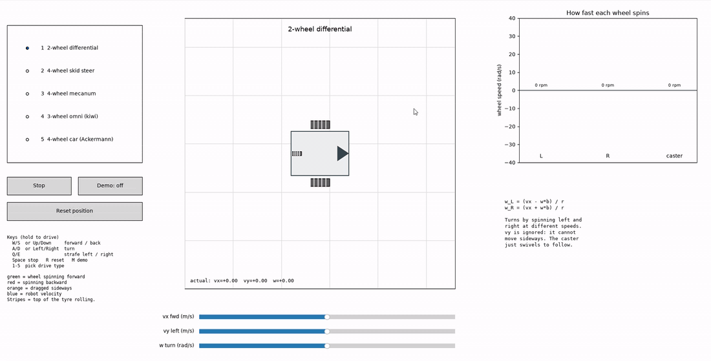

<div align="center">

# 🚗 Interactive Wheel Kinematics Viewer

*See exactly how every wheel spins for differential, skid steer, mecanum, omni and Ackermann robots*

     

</div>

---

## 🎬 Demo

<div align="center">
  
</div>

> Driving all five drive types with the keyboard (2x speed). Watch the wheel colours flip as the robot turns and strafes. The orange slip arrows appear on the skid steer, the mecanum wheels spin in an X pattern when strafing, and the Ackermann front wheels steer at different angles.


---

## 📖 What is this?

An interactive simulator that shows **how each wheel of a robot has to spin** to make the robot move the way you ask.

Pick a drive type, tell the robot how to move (forward, sideways, turn), and watch every wheel respond live. It is a visual way to learn **wheel kinematics**, the maths that connects robot motion to wheel speeds.

## 👀 What it helps you see

- 🔄 **Which way each wheel spins and how fast.** Stripes slide along the tyre as it rolls. Green means forward, red means backward, grey means stopped. A bar chart shows the exact speed in rad/s and rpm.
- ↔️ **Why some robots can strafe and others cannot.** Mecanum and omni robots move sideways; differential, skid steer and car-style robots ignore the sideways command.
- 🟠 **Wheel slip.** On a skid steer robot, turning drags the wheels sideways (orange arrows). This is why skid steer odometry is poor at measuring turns.
- 🛞 **Steering geometry.** On the car (Ackermann), the inner front wheel steers more than the outer one, and the car cannot turn on the spot.
- 🧮 **The equations behind it.** Each drive type shows its kinematics formulas next to the live values.
- 🧭 **The path the robot takes.** A trail shows where it has been, and a blue arrow shows its current velocity.

## 🤖 Drive types

| # | Drive type | Wheels | Can strafe? | Notes |
|---|---|---|:---:|---|
| 1 | 2-wheel differential | 2 driven + caster | ❌ | Turns by spinning left and right at different speeds. The caster swivels to follow. |
| 2 | 4-wheel skid steer | 4 fixed, square layout | ❌ | Same maths as differential, but wheels scrub sideways when turning (like a Husky). |
| 3 | 4-wheel mecanum | 4 fixed, 45° rollers | ✅ | Moves in any direction and can spin while strafing. |
| 4 | 3-wheel omni (kiwi) | 3 omni, 120° apart | ✅ | Each wheel pushes along its own direction; rollers slide freely the other way. |
| 5 | 4-wheel car (Ackermann) | 2 steered + 2 fixed | ❌ | Front wheels steer so all wheels circle the same point. Max steer 35°. |

## 🚀 Quick start

```bash
pip install -r requirements.txt
python wheel_viewer.py
```

Needs Python 3.8+ with `matplotlib` and `numpy`. Click on the window once so it receives keyboard input.

## 🎮 Controls

### ⌨️ Keyboard (hold to drive)

Speed builds up while a key is held and eases back to zero when released, like an RC car. Keys can be combined (for example `W` + `A` for an arc).

| Key | Action |
|---|---|
| `W` / `S` or `↑` / `↓` | Forward / back |
| `A` / `D` or `←` / `→` | Turn left / right |
| `Q` / `E` | Strafe left / right (mecanum and omni only) |
| `Space` | Stop |
| `R` | Reset position |
| `M` | Demo on / off |
| `1` to `5` | Pick drive type |

### 🖱️ Mouse

- **Radio buttons** (left): pick the drive type.
- **Sliders** (bottom): set a steady command.
  - `vx`: forward speed, m/s
  - `vy`: sideways speed, m/s
  - `w`: turn rate, rad/s

  The sliders also follow the keyboard, so they always show the current command.
- **Stop**: sets everything to zero and turns the demo off.
- **Demo**: runs a fixed sequence, 3 s per step: forward, reverse, spin in place, arc left, strafe left, diagonal, strafe + spin. Run it on each drive type to compare how they handle the same commands.
- **Reset position**: moves the robot back to the start and clears the trail.

## 📁 Project structure

```
Robot_Wheel_Orientation/
├── README.md          this file
├── requirements.txt   matplotlib, numpy
├── wheel_viewer.py    the whole simulator (single file)
├── video.mp4          full demo recording
└── assets/
    └── demo.gif       demo shown above (2x speed)
```

Inside `wheel_viewer.py`:

| Part | What it does |
|---|---|
| ⚙️ Constants (`R`, `WW`, `A`, `B`, `KIWI`, `MAX_STEER`, `DT`) | Wheel radius, wheel width, half wheelbase, half track, omni wheel radius from centre, steering limit, time step. Change these to match a real robot. |
| 🎬 `DEMO` | The demo sequence (label, vx, vy, w). |
| 🤖 `ROBOTS` | Every drive type: body shape, wheel list (position, kind, roller direction) and the equation text. |
| 🧮 `solve()` | The kinematics. Turns a body command (vx, vy, w) into each wheel's heading, spin speed and sideways slip. It also applies each drive's limits (no strafing, no turning in place, etc.). |
| 🎨 `make_wheel()` / `update_wheel()` | Create each wheel's graphics once, then move and colour them every frame. |
| ⌨️ `DRIVE_KEYS`, `MAX_CMD`, `ACCEL` | Keyboard mapping, top speeds and how quickly the keys ramp speed up and down. |
| 🏗️ `build()` | Builds the window, widgets, keyboard handling and the animation loop (blitted for smooth frame rates). |

## 🧮 How the kinematics work

For a robot moving with forward speed `vx`, sideways speed `vy` and turn rate `w`, a wheel at position `(px, py)` on the robot has its contact point moving at:

```
cx = vx - w * py
cy = vy + w * px
```

- **Fixed wheel:** the part of that motion along the wheel's direction becomes its spin (`speed / r`). The part across the wheel is slip.
- **Mecanum wheel:** spin = `(cx +/- cy) / r`. The 45° rollers take up the rest.
- **Omni wheel:** spin = motion along its rolling direction. The rollers absorb the rest.
- **Steered wheel or caster:** it turns to point along its own motion, so it never slips.
